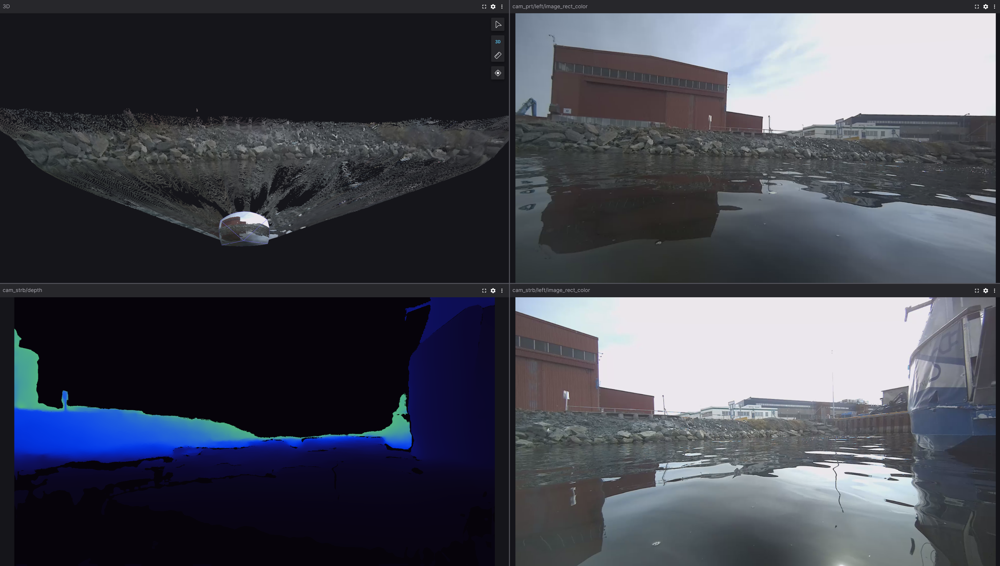

# SVO to MCAP Converter

A tool for converting [Stereolabs ZED camera](https://www.stereolabs.com/) SVO(2) recordings to [MCAP](https://mcap.dev/) format, enabling seamless visualization in [Foxglove Studio](https://foxglove.dev/).

## Visualization

The resulting MCAP files can be visualized in [Foxglove Studio](https://foxglove.dev/) or processed with ROS2 tools.


## Overview

This utility converts ZED camera SVO recordings (`.svo`/`.svo2` files) to MCAP format (`.mcap` files). The tool only supports the following camera data:

- Regular camera images (RGB/grayscale)
- Depth maps
- Point clouds
- Camera calibration information

The tool supports multiple ZED cameras and customizable output configurations through a YAML-based configuration system.

## Features

- **High-performance:** Multi-threaded message processing for efficient conversion
- **Flexible configuration:** YAML-based configuration for cameras and output settings
- **Multiple data types:** Support for images, depth maps, point clouds, and more
- **Progress tracking:** Real-time conversion progress display with FPS monitoring
- **ROS2 compatibility:** Outputs standard ROS2 message types for maximum compatibility

## Prerequisites

- CMake (3.5 or newer)
- ZED SDK
- CUDA (compatible with your ZED SDK version)
- ROS2 dev libraries (std_msgs, sensor_msgs, rclcpp)

## Building

```bash
cmake -B build -DCMAKE_BUILD_TYPE=RelWithDebInfo
cmake --build build --parallel
```

## Usage

Create a configuration file (e.g., `config.yaml`) and run:

```bash
./svo_to_mcap config.yaml
```

You can press Ctrl+C at any time to gracefully terminate the conversion process.

## Configuration

The tool uses YAML configuration files. Here's an example:

```yaml
cameras:
  - name: zed_camera_1
    svo_file: /path/to/cam1_recording.svo
    settings:
        depth_mode: NEURAL
        coordinate_units: METER
    channels:
      - name: left
        type: VIEW::LEFT
      - name: right
        type: VIEW::RIGHT
      - name: depth
        type: MEASURE::DEPTH_U16_MM
      - name: point_cloud
        type: MEASURE::XYZRGBA

  - name: zed_camera_2
    svo_file: /path/to/cam2_recording.svo
    channels:
      - name: right
        type: VIEW::RIGHT
output:
  file: output.mcap
  compression: lz4  # Options: zstd, lz4, none
```

### Camera Configuration

- `name` (required): Camera identifier (used for output channel naming)
- `svo_file` (required): Path to the SVO recording file
- `channels`: List of data channels to extract
- `settings`: Camera settings
    - `depth_mode`: Depth mode, corresponds to ZED SDK enum sl::DEPTH_MODE (Defaults is NONE)
    - `coordinate_units`: Coordinate units, corresponds to ZED SDK enum sl::UNIT (Default is METER)

### Channel Types

Channels can be one of two types (sl::VIEW or sl::MEASURE):

1. VIEW types (prefixed with `VIEW::`):
   - `LEFT`, `RIGHT`, `LEFT_UNRECTIFIED`, `RIGHT_UNRECTIFIED`, etc.

2. MEASURE types (prefixed with `MEASURE::`):
   - `DEPTH`, `DISPARITY`, `XYZ`, `XYZRGBA`, etc.

See the [ZED API documentation](https://www.stereolabs.com/docs/api/) for a complete list of VIEW and MEASURE types.

## Output

The converter produces an MCAP file with the following ROS2 message types:

- `sensor_msgs/msg/Image`: For regular images and depth maps
- `sensor_msgs/msg/CameraInfo`: Camera calibration information
- `sensor_msgs/msg/PointCloud2`: For point cloud data

More messages can easily be added such as IMU, temperature, detected objects etc, but I don't need those (for now).

## Merging with ROS2 Recordings

You can easily merge the converted MCAP file with existing ROS2 recordings using the [mcap CLI tool](https://mcap.dev/guides/cli):

```bash
mcap merge output.mcap ros2_recording.mcap -o combined.mcap
```
